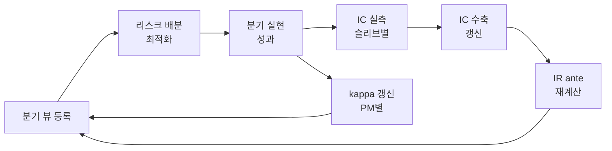

# 리스크 배분 모형 — IC 기반 사전 IR과 최적화 설계

> **요약.** Natixis 모형의 구조는 타당하지만 수준은 과대하다. 목적함수와 제약의 형태는 리스크 공간에서 푼 평균-분산 최적화로 정당하게 도출되고, 최적해에서 $IR^2 = \sum_i IR_i^2$ 가 복원된다. 문제는 세 항의 누락이다 — 전이계수(TC), 슬리브 내부 베팅 상관, 뷰의 분산 보정. 이를 넣으면 기대 IR이 원 모형의 30% 수준으로 내려오며, 이것이 실현값에 가깝다. 대안은 실현 IR을 그대로 쓰는 것이 아니라 사전적 IR을 IC로 조립하는 것이다. IR은 결과라 늦게 보이고, IC는 원인이라 빨리 보인다.

---

## 1. 원자료의 논리 흐름

Ostrum / EDHEC-Risk "Fixed-Income Portfolio Construction with Active Views" 강의의 전개는 다음 일곱 단계다. 각 단계는 그 자체로 타당하며, 문제는 마지막 단계에서 앞의 항들이 결합되는 방식에 있다.

### 1.1 액티브 운용은 예측이다

$$
\mathrm{Alpha} \;=\; \mathbb{E}[R_{\text{Ptf}}] - \mathbb{E}[R_{\text{Bench}}], \qquad IR \;=\; \frac{\mathrm{Alpha}}{TE}
$$

정보비율의 역할은 둘이다. 액티브 운용 과정에서 투자 기회의 질을 재고, 운용역이 가치를 더하는 능력을 정의한다. 같은 트래킹 에러를 써도 알파는 정보비율에 비례하므로, 리스크를 늘리는 것은 해법이 아니다.

### 1.2 시장을 이기는 두 가지 원천 — FLAM

$$
IR \;\approx\; IC \sqrt{BR}
$$

Grinold(1989)는 가치의 원천을 둘로 나눈다. 잔차수익을 맞히는 예측력(IC, 예측과 실현수익의 상관)과 그 예측력을 1년에 쓰는 횟수(BR)다. 원자료는 세 가지 상충을 함께 제시한다 — 스킬과 베팅 수, 확장성과 수용능력, 성과와 제약.

### 1.3 뷰에서 알파로

$$
\mathrm{Alpha} \;=\; IC \times TE \times \mathrm{Score}
$$

Grinold(1994). 알파는 스킬·리스크·기대의 함수다. 원시 예측(스코어)을 리스크와 정보계수로 스케일링해 알파를 얻는다. $IC = 0$ 이면 정보 없는 스코어는 알파 0으로 변환된다.

뷰는 리스크 요인의 예상 움직임과 일대일로 대응시켜 받는다. 방향성 크레딧 뷰의 예시는 다음과 같다.

| 방향성 크레딧 뷰 | Very Bear | Bear | Neutral | Bull | Very Bull |
|---|---|---|---|---|---|
| 예상 상대 스프레드 변동 | > +10% | +3% ~ +10% | −3% ~ +3% | −10% ~ −3% | < −10% |
| 최적화 입력값 View | −2 | −1 | 0 | +1 | +2 |

기대수익은 PM의 주관적 뷰에 조건부이고, 리스크 모형은 통계적 계산으로 남는다.

최적화에 들어가는 View 값은 다섯 단계이며, 각 단계마다 익스포저 범위가 정의되어 있다.

| View | −2 | −1 | 0 | +1 | +2 |
|---|---|---|---|---|---|
| 원자료 표기 | Strong under exposure | Under exposure | Neutrality | Over exposure | Strong over exposure |
| 해석 | 강한 언더웨이트 | 언더웨이트 | 중립 | 오버웨이트 | 강한 오버웨이트 |

이 척도는 순위표가 아니라 z-score다. 분산 1이라는 전제가 깨지면 — PM 응답이 ±2에 몰리면 — 알파가 $\sqrt{2}$ 배까지 부풀려진다. §6.1의 뷰 분산 보정이 필요한 지점이다.

### 1.4 제약의 반영 — 전이계수

$$
IR \;\approx\; IC\sqrt{BR}\,TC \;\;\le\;\; IC\sqrt{BR}
$$

Clarke, de Silva, Thorley(2002). 원래의 FLAM은 공매도 금지 같은 포트폴리오 제약을 고려하지 않은 채 부가가치를 계산한다. TC는 포지션과 예측의 상관으로 정의되며, 제약은 기회를 제한해 정보비율을 반드시 깎는다.

### 1.5 독립된 뷰의 결합

$$
IR_{\text{total}}^{2} \;=\; IR_{1}^{2} + IR_{2}^{2} + \cdots + IR_{n}^{2}
$$

원자료의 예시는 월간 방향성 전략과 분기 배분 전략을 결합한다.

| 항목 | 방향성 전략 (월간) | 배분 전략 (분기) | 결합 |
|---|---|---|---|
| 적중률 $P$ | 0.57 | 0.63 | 0.59 |
| 정보계수 $IC = 2P - 1$ | 0.14 | 0.25 | 0.18 |
| 연간 베팅 수 $BR$ | 12 | 4 | 16 |
| 정보비율 $IR$ | 0.50 | 0.50 | **0.71** |

두 경로가 정확히 일치한다 — $\sqrt{0.50^2 + 0.50^2} = 0.71$ 이고 $0.18 \times \sqrt{16} = 0.71$ 이다. 여기서 $IC = 2P - 1$ 이라는 적중률과 정보계수의 대응 관계가 명시적으로 쓰인다는 점에 주목할 만하다. 실무에서 PM에게 물을 수 있는 것은 IC가 아니라 적중률이므로, 이 대응이 IC 추정의 실질적 출발점이 된다.

### 1.6 상관된 뷰의 결합

$$
IR_{\text{comb}} \;=\; \sqrt{\frac{IR_1^2 + IR_2^2 - 2\rho\, IR_1 IR_2}{1-\rho^2}}
$$

뷰는 대체로 서로 상관되어 있다. 전략이 상관될수록 결합의 이득은 줄어들고, 중복된 정보만큼 결합 정보비율이 깎인다.

| 상관계수 $\rho$ | 0.0 | 0.3 | 0.6 | 1.0 |
|---|---|---|---|---|
| 결합 $IR$ (개별 0.50) | 0.71 | 0.62 | 0.55 | 0.50 |

이것이 §5.2의 유효 breadth와 §4.3의 IC 집계 포화가 뿌리를 두는 지점이다. 원자료는 이 그림을 제시하면서도 정작 최적화식에는 상관을 반영하지 않는다.

### 1.7 스킬 추정치가 배분을 바꾼다

Aggregate 모델 포트폴리오에서 PM이 뷰와 스킬 수준을 정의하는 전략은 여섯이다.

| 구분 | 전략 | 성격 |
|---|---|---|
| 배분 | Long corporate versus German bonds | 크레딧 스프레드 방향성 |
| 배분 | Short sovereign versus German bonds | 국채 스프레드 방향성 |
| 국가 | Long Spain versus Belgium · Long Italy versus France | 주변국 스프레드 상대가치 |
| 듀레이션·기타 | Short duration · Long emerging bonds | 금리 방향성과 신흥국 캐리 |

원자료는 배분 전략의 스킬을 10%에서 20%로 올렸을 때의 변화를 보여준다. 총 트래킹 에러는 두 경우 모두 40bp로 고정되어 있다.

- 배분 전략(Long Corp vs DE, Short SOV vs DE)으로 액티브 리스크와 알파 기여가 크게 이동한다
- 정보비율은 0.35에서 0.69로 올라간다

스킬 추정치 하나가 바뀌면 배분이 두 배 넘게 바뀐다. 이 민감도가 §6.1의 추정오차 페널티를 필요로 하는 직접적 근거다.

---

## 2. 원 모형의 구조와 도출

### 2.0 입력과 산출

원자료의 도식은 입력을 두 종류로 나눈다.

| 구분 | 항목 | 성격 |
|---|---|---|
| 실선 상자 | 리스크 요인별 방향성 뷰 · 슬리브별 스킬(IC) · 과거 변동성과 상관행렬 | PM과 데이터가 제공 |
| 점선 상자 | 리스크 예산(총 액티브 리스크) · 제약 | 위원회가 승인 |

둘이 포트폴리오 구축(최적화)으로 합류해 **전술적 뷰에 대한 최적 리스크 배분**과 **자산배분에 대한 최적 익스포저**를 낸다. 산출이 종목 가중치가 아니라 리스크 배분이라는 점이 이 모형의 성격을 규정한다. 가중치는 그다음 단계에서 나온다.

원 모형은 가중치 공간이 아니라 **리스크 공간에서 푸는 평균-분산 최적화**다. 목적함수는 Grinold 알파를 슬리브 단위로 올린 것이고, 제약은 액티브 리스크 예산이다.

$$
\max_{TE_1,\dots,TE_n} \;\sum_{i=1}^{n} IC_i \;\times\; \sqrt{BR_i} \;\times\; TE_i \;\times\; View_i \qquad \text{s.t.} \quad TE^2 \le \sigma_A^2
$$

### 2.1 슬리브 기대 알파

IR의 정의상 슬리브 $i$ 의 기대 초과수익은 $\alpha_i = IR_i \times TE_i$ 다. 여기에 Fundamental Law $IR_i = IC_i\sqrt{BR_i}$ 를 대입하고, Grinold의 $\alpha = IC \cdot \sigma \cdot \text{score}$ 에서 score 자리에 표준화된 뷰를 넣으면 목적함수의 각 항이 나온다.

$$
\alpha_i \;=\; IC_i \,\sqrt{BR_i} \;\cdot\; TE_i \;\cdot\; View_i
$$

즉 목적함수는 **총 기대 액티브 수익**이다.

### 2.2 문제 구조와 해

$a_i \equiv IC_i\sqrt{BR_i}\,View_i$ (뷰로 부호와 강도가 붙은 IR), $C$ = 슬리브 간 상관행렬로 두면 목적은 선형, 제약은 볼록 2차다. 해는 경계에서 나오고 닫힌 형태를 갖는다.

$$
TE^\star \;=\; \sigma_A\,\frac{C^{-1}a}{\sqrt{a^\top C^{-1}a}}, \qquad IR^\star \;=\; \sqrt{a^\top C^{-1}a}
$$

$C = I$ 이면 $TE_i^\star \propto IC_i\sqrt{BR_i}\,View_i$ — 리스크 예산을 각 뷰의 IR과 확신도에 비례해 배분하라는 결과다. 그리고 $IR^2 = \sum_i IR_i^2$ 이 최적해의 *결과*로 도출된다. 식이 임의로 만들어진 것이 아니라는 근거다.

---

## 3. 원 모형의 네 가지 결함

누락된 항들이 **모두 한 방향으로** 작용해 기대 IR을 부풀린다.

| 결함 | 내용 | 배수 효과 |
|---|---|---|
| TC 누락 | 롱온리·회전율·유동성 제약으로 뷰의 일부만 포지션으로 전이 | ×0.5 |
| 슬리브 내부 상관 | $\sqrt{BR}$ 은 하위 베팅 무상관 전제. 실제 $\bar\rho = 0.2 \sim 0.4$ | ×0.47 |
| View 분산 미보정 | $\{-2,\dots,2\}$ 가 z-score이려면 분산 1 필요. 실제는 더 넓음 | ×0.7 |
| 선형 목적 | IC 추정오차가 코너해로 증폭 | 배분 왜곡 |

세 배수를 곱하면 약 0.16배 — 기대 IR이 실제의 여섯 배쯤 나온다.

### 3.1 편향이 균일하지 않다는 점이 더 위험하다

모든 슬리브가 똑같이 부풀려진다면 최적 *배분 비율*은 그대로라 실무상 큰 문제가 아니다. 그러나 실제로는 다르다.

- FX 슬리브는 레버리지가 자유로워 $TC \approx 0.8$
- 롱온리 주식 국가배분은 공매도 제약으로 $TC \approx 0.3$
- 명목 breadth가 큰 슬리브일수록 내부 신호 상관도 높은 경향

즉 **breadth가 커 보이는 슬리브일수록 더 크게 과대평가**된다. 목적함수가 선형이라 이 차등 편향이 그대로 코너해로 증폭되고, 결과적으로 최적화가 가장 부풀려진 슬리브에 리스크를 몰아준다. 그림의 Constraints 박스와 슬리브별 exposure range가 사실상 이 문제를 막는 임시 장치다.

---

## 4. 층위 — 슬리브와 개별 베팅

### 4.1 슬리브(sleeve)

하나의 독립적인 알파 원천 단위. 액티브 리스크 예산을 쪼개 배분하는 그릇이다. 원 모형의 $i = 1,\dots,n$ 은 이 단위를 가리킨다.

| 슬리브 | 내부 개별 베팅 | 명목 BR |
|---|---|---|
| 듀레이션 | 미국·독일·일본 커브 포지션 | 12 |
| FX | EUR/USD, USD/JPY, EM 통화 | 10 |
| 주식 국가배분 | 20개국 over/under weight | 20 |
| 크레딧 | IG vs HY, 섹터 | 8 |

### 4.2 두 층위를 섞으면 안 되는 이유

Grinold 원식 $\alpha = IC \cdot \sigma \cdot z$ 는 **베팅 하나**에 대한 조건부 기대값이다. 여기에는 $\sqrt{BR}$ 이 들어갈 자리가 없다. 반면 $IC\sqrt{BR}$ 은 그런 베팅을 $BR$ 개 모았을 때 나오는 **집계 결과**다.

$$
IR \;=\; \sqrt{\alpha^\top V^{-1}\alpha} \;=\; IC\sqrt{\textstyle\sum_i z_i^2}, \qquad \mathbb{E}\!\left[\sum_i z_i^2\right] = BR
$$

단순합 $\sum_i z_i$ 는 기대값이 0이라 쓸 수 없다. 제곱합이라야 신호의 부호와 무관하게 정보량이 누적된다. 즉 $IC\sqrt{BR}$ 은 **$z$ 를 평균해 없앤 사전 기대값**이고, 여기에 $View_i$ 를 다시 곱하면 같은 정보를 두 번 세게 된다.

$$
\underbrace{IC_i\sqrt{BR_i}}_{z \text{ 를 평균해 소거}} \;\times\; TE_i \;\times\; \underbrace{View_i}_{z \text{ 를 다시 명시}}
$$

정합적으로 읽는 길은 하나다 — $View_i$ 를 슬리브 내부 베팅들의 확신도가 아니라 **슬리브 전체를 한 방향으로 기울이는 별도의 탑다운 신호**로 못박는 것이다. 리서치 모델이 내는 하위 베팅은 $\sqrt{BR_i}$ 에 흡수되고, PM은 그 위에서 슬리브 단위 기울기만 지시한다. PM이 "EM 통화 8개가 좋아 보여서 +2"라고 답했다면 아래층 정보를 위층 자리에 넣은 것이고, $\sqrt{BR}$ 과 정확히 같은 것을 중복 계산한다.

### 4.3 IC 집계는 포화한다

신호를 늘리는 축에서도 $\sqrt{N}$ 은 근사일 뿐이다. IC는 상관계수라 1을 넘을 수 없다.

$$
IC_{\text{comp}} \;=\; \frac{\rho\sqrt{N}}{\sqrt{1 + (N-1)\gamma}}
$$

| $\rho$ | $N$ | 순진한 $\rho\sqrt{N}$ | 정확한 값 ($\gamma = \rho^2$) |
|---|---|---|---|
| 0.05 | 10 | 0.158 | 0.156 |
| 0.10 | 10 | 0.316 | 0.303 |
| 0.30 | 10 | 0.949 | 0.705 |
| 0.50 | 10 | 1.581 (불가능) | 0.877 |

IC가 작을 때는 $\sqrt{N}$ 근사가 거의 정확하다. 금융 IC가 보통 0.02~0.08이라 실무에서 이 근사를 쓰는 이유다. 다만 신호 간 상관 $\gamma$ 가 실무 수준(0.3~0.6)이면 이야기가 달라진다. $\rho = 0.05$, $N = 10$, $\gamma = 0.4$ 이면 $IC_{\text{comp}} = 0.074$ — 3.16배가 아니라 **1.47배**다. 신호 개수보다 신호 간 비상관성이 압도적으로 중요하다.

두 축은 구분되며 서로 곱해진다.

$$
IR \;=\; \underbrace{IC_{\text{comp}}}_{\text{신호 축 — 상한 } 1} \;\times\; \underbrace{\sqrt{BR^{\text{eff}}}}_{\text{자산 축 — 상한 없음}} \;\times\; TC
$$

---

## 5. 사전 IR의 재구성

사전적 IR은 세 항의 곱으로 정합적으로 세울 수 있다. 핵심은 BR을 명목이 아닌 **유효 breadth**로 쓰고, TC를 명시하는 것이다.

$$
IR_i^{\text{ante}} \;=\; IC_i \;\times\; \sqrt{BR_i^{\text{eff}}} \;\times\; TC_i, \qquad BR_i^{\text{eff}} \;=\; \frac{BR_i}{1 + (BR_i - 1)\bar\rho_i}
$$

### 5.1 IC — 신호 복합 IC와 수축

표본 IC는 위쪽으로 편향되므로 수축이 필수다. $T_0 = 36$ 개월, 사전값 0.03 정도를 기본으로 둔다. 이력 3년이면 실측에 50%만 가중된다.

$$
IC_i^{\text{shrunk}} \;=\; w\,\widehat{IC}_i \;+\; (1-w)\,IC^{\text{prior}}, \qquad w = \frac{T}{T + T_0}
$$

### 5.2 유효 breadth — 가장 큰 보정

$\bar\rho_i$ 는 슬리브 내 베팅 수익률의 실현 상관으로 직접 측정한다. 효과가 크다.

| 명목 $BR$ | $\bar\rho$ | $BR^{\text{eff}}$ | $\sqrt{BR^{\text{eff}}}$ |
|---|---|---|---|
| 20 | 0.0 | 20.0 | 4.47 |
| 20 | 0.2 | 4.2 | 2.05 |
| 20 | 0.4 | 2.4 | 1.55 |
| 10 | 0.3 | 2.7 | 1.64 |

명목 20개 국가 베팅이 상관 0.2면 실질적으로 4개다. 주식 국가배분은 글로벌 베타 공통성 때문에 $\bar\rho$ 가 0.3~0.5로 높고, FX 캐리는 0.15~0.25, 커브 포지션은 0.1 내외다.

의사결정 빈도도 breadth 축이다. 분기 리밸런싱이면 연 $BR = N \times 4$ 이지만, 뷰가 분기별로 독립이 아니면 같은 감쇠가 걸린다. 실제 뷰 변경률로 확인해야 한다.

### 5.3 TC — 전이계수

목표 포지션과 실제 포지션의 상관. 백테스트로 사전 측정 가능하다.

$$
TC_i \;=\; \mathrm{corr}\!\left(w^{\text{target}},\, w^{\text{actual}}\right)
$$

| 제약 조건 | 전형적 $TC$ |
|---|---|
| 롱숏, 레버리지 자유 | 0.8~0.9 |
| 롱온리, 섹터중립 | 0.4~0.6 |
| 롱온리 + 회전율 상한 + 유동성 | 0.3~0.45 |

### 5.4 적용 결과

| 슬리브 | $IC$ | $BR$ | $\bar\rho$ | $BR^{\text{eff}}$ | $TC$ | $IR^{\text{ante}}$ | 원 식 |
|---|---|---|---|---|---|---|---|
| 듀레이션 | 0.06 | 12 | 0.15 | 4.3 | 0.75 | 0.093 | 0.208 |
| FX | 0.05 | 10 | 0.20 | 3.6 | 0.80 | 0.076 | 0.158 |
| 주식 국가배분 | 0.04 | 20 | 0.35 | 2.6 | 0.40 | 0.026 | 0.179 |
| 크레딧 | 0.05 | 8 | 0.30 | 2.5 | 0.50 | 0.040 | 0.141 |

독립 가정 시 총 $IR = \sqrt{\sum_i IR_i^2} = 0.13$. 같은 입력을 원 식($IC\sqrt{BR}$, 보정 없음)으로 계산하면 0.42 — **3.2배 차이**다. 특히 주식 국가배분이 0.179에서 0.026으로 7배 줄어드는 점에 주목할 만하다. 명목 breadth가 크고 제약이 많은 슬리브일수록 원 식이 크게 과대평가한다는 것이 수치로 드러난다.

---

## 6. 개선된 최적화식

$$
\max_{TE} \;\; a^\top TE \;-\; \tfrac{\lambda}{2}\,TE^\top \Omega\, TE \qquad \text{s.t.} \quad TE^\top C\,TE \le \sigma_A^2, \quad 0 \le TE_i \le \bar{TE}_i
$$

뷰가 반영된 유효 IR 벡터는 다음과 같다.

$$
a_i \;=\; IR_i^{\text{ante}} \cdot \frac{View_i}{\sigma_{View}} \cdot \kappa_i, \qquad IR_i^{\text{ante}} = IC_i\sqrt{BR_i^{\text{eff}}}\,TC_i
$$

| 항 | 역할 | 출처 |
|---|---|---|
| $IR^{\text{ante}}$ | 슬리브 사전 정보비율 | IC · 유효 breadth · TC |
| $View / \sigma_{View}$ | 스케일 보정된 확신도 | PM 제출 + 응답 이력 표준편차 |
| $\kappa$ | PM 캘리브레이션 계수 | 과거 뷰와 실현수익의 상관 |
| $C$ | 슬리브 간 상관행렬 | 60개월 실현 상관 |
| $\lambda\Omega$ | 추정오차 페널티 | 각 슬리브 IR 추정치의 표준오차 |

### 6.1 각 추가 항의 근거

**$\kappa$ — PM 캘리브레이션.** 과거에 이 PM의 뷰가 실제로 맞았는지를 반영하는 수축 계수다. 원 그림의 Skills 박스가 명목상 담당하는 역할을 실측으로 채우는 자리이며, 이력이 짧으면 0.5 쪽으로 수축시킨다.

**$\lambda\Omega$ — 코너해 방지.** $\Omega = \mathrm{diag}(\mathrm{Var}(\hat a_i))$, 즉 각 슬리브 IR 추정치의 표준오차다. 이력이 짧은 슬리브일수록 페널티가 커져 리스크 배분이 자동으로 줄어든다. 원식은 목적이 선형이라 추정오차가 그대로 코너해로 증폭되는데, 이 2차항이 Black-Litterman의 신뢰도 가중과 같은 역할을 한다.

**환원 확인.** $\lambda = 0$, $\Omega = 0$, $C = I$, $TC = \kappa = 1$ 이면 원식으로 정확히 돌아간다. 확장이지 대체가 아니다.

### 6.2 최적해

$\lambda = 0$ 이고 상한이 비구속이면 닫힌 형태가 유지된다.

$$
TE^\star \;=\; \sigma_A \frac{C^{-1}a}{\sqrt{a^\top C^{-1}a}}, \qquad IR^\star \;=\; \sqrt{a^\top C^{-1}a}
$$

$C = I$ 일 때 $IR^2 = \sum_i IR_i^2$ 가 복원되지만, 이제 각 $IR_i$ 는 TC·유효 breadth·PM 스킬이 모두 차감된 값이다.

---

## 7. 투자위원회 운영 규칙

### 7.1 한 줄 설명

트래킹 에러 예산을 **각 전략의 사전 정보비율과 이번 분기 확신도**에 비례해 배분하고, 실현 가능한 만큼만 반영한다.

### 7.2 위원회가 직접 승인하는 항목

1. **총 액티브 리스크 $\sigma_A$** — 모든 것의 출발점이며 유일하게 위원회가 직접 정하는 수치 (예: 400bp)
2. **전략별 상한 $\bar{TE}_i$** — 한 전략에 리스크가 몰리는 것을 막는 장치. 통상 $\sigma_A$ 의 40% 이하
3. **뷰 예산** — PM당 $\sum_i \lvert View_i \rvert \le 4$. 전 전략에 ±2를 찍는 것을 구조적으로 차단
4. **사전 뷰 등록** — 뷰는 분기 시작 시점에 고정하고 사후 수정 불가. $\kappa$ 측정의 전제

### 7.3 배분 결과 예시

유효 IR 벡터를 $a_i = IR_i^{\text{ante}} \times View_i$ 로 두면 무제약 최적해는 다음과 같다.

$$
TE^\star \;=\; \sigma_A \frac{a}{\lVert a \rVert}, \qquad \lVert a \rVert \;=\; \sqrt{0.186^2 + 0.076^2 + 0.040^2} \;=\; 0.2049
$$

| 전략 | $IR^{\text{ante}}$ | 확신도 | $a_i$ | 무제약 TE | 상한 적용 TE | 기대 기여 |
|---|---|---|---|---|---|---|
| 듀레이션 | 0.093 | +2 | 0.186 | 363bp | **160bp** | 30bp |
| FX | 0.076 | +1 | 0.076 | 148bp | 148bp | 11bp |
| 주식 국가배분 | 0.026 | 0 | 0 | 0bp | 0bp | 0bp |
| 크레딧 | 0.040 | +1 | 0.040 | 78bp | 78bp | 3bp |
| **합계** | | | | **400bp** | **231bp** | **44bp** |

**합산은 제곱합이다.** 무제약 해는 $\sqrt{363^2 + 148^2 + 78^2} = 400$bp로 승인 예산을 정확히 소진한다. 그러나 슬리브 상한 160bp가 듀레이션에 구속되면서 실제로는 $\sqrt{160^2 + 148^2 + 78^2} = 231$bp만 쓰이고 169bp가 남는다. 이때 기대 총 IR은 $44/231 = 0.19$ 다.

확신도 0인 전략은 배분 0 — 뷰가 없으면 리스크를 쓰지 않는다는 원칙이다. 미사용 169bp를 어떻게 볼 것인지는 실행 부록에서 다룬다 ([실행 부록](Risk_Budgeting_Implementation_Appendix.md) §4).

### 7.4 검증 기준

기대 총 IR이 **1.0을 넘는 결과가 나오면 입력값에 오류가 있다**고 보는 것이 맞다. 멀티에셋 액티브에서 방어 가능한 사전 IR은 0.15~0.35 구간이다.

### 7.5 사후 검증 루프

분기마다 실현 IC를 측정해 수축 갱신하면, 첫해는 사전 추정에 의존하다가 3~4년 뒤에는 사실상 실현 IR과 수렴한다. 누적 괴리가 큰 전략은 IC 사전값을 하향 조정한다.

---

## 8. 왜 IR이 아니라 IC로 관리하는가

### 8.1 통계적 효율

IR을 유의하게 추정하려면 연 단위 수익률이 필요해 5년으로도 표준오차가 크다. IC는 매월 횡단면에서 측정되므로 5년이면 관측치가 60개, 종목 100개면 유효 표본이 6,000개다.

$$
SE(\widehat{IC}) \;\approx\; \frac{1}{\sqrt{N \cdot T}}
$$

100종목 × 60개월이면 $SE \approx 0.013$. $IC = 0.05$ 를 3~4년이면 유의하게 판별한다. 같은 기간 IR은 거의 판별되지 않는다.

### 8.2 진단 가능성

IR이 나빠지면 원인을 알 수 없다. IC 기반 분해는 위원회가 조치할 지점을 특정해준다.

| 지표 악화 | 원인 | 조치 |
|---|---|---|
| $IC$ 하락 | 예측력 소실, 알파 감쇠 | 신호 재검토, 전략 축소 |
| $BR^{\text{eff}}$ 하락 | 베팅 상관 상승, 집중화 | 유니버스 확대, 신호 다변화 |
| $TC$ 하락 | 제약 강화, 유동성 악화, 회전율 한계 | 집행 프로세스, 제약 재검토 |
| $\kappa$ 하락 | PM 뷰의 캘리브레이션 실패 | 뷰 권한 축소 |

### 8.3 PM 귀속

IC는 PM의 예측 자체를 평가하므로, **제약 때문에 성과가 안 난 PM과 예측이 틀린 PM을 구분**한다. IR만 보면 둘이 같은 숫자로 나타난다.

### 8.4 운영 원칙

IR은 결과라 늦게 보이고, IC는 원인이라 빨리 보인다. **IC로 관리하고 IR로 검증한다.**

---

## 부록 A. 기호 정리

| 기호 | 의미 |
|---|---|
| $IC_i$ | 슬리브 $i$ 의 정보계수 — 예측과 실현수익의 횡단면 상관 |
| $BR_i$ | 명목 breadth — 슬리브 내 독립 베팅의 수 |
| $BR_i^{\text{eff}}$ | 유효 breadth — 베팅 간 상관 $\bar\rho_i$ 로 감쇠된 값 |
| $TC_i$ | 전이계수 — 목표 포지션 대비 실제 포지션의 상관 |
| $TE_i$ | 슬리브에 배분된 트래킹 에러 |
| $\sigma_A$ | 총 액티브 리스크 예산 |
| $View_i$ | PM 제출 확신도, $\{-2,-1,0,+1,+2\}$ |
| $\kappa_i$ | PM 캘리브레이션 계수 |
| $C$ | 슬리브 간 상관행렬 |
| $\gamma$ | 신호 간 상관 (IC 집계 축) |
| $\bar\rho_i$ | 슬리브 내 베팅 간 평균 상관 (breadth 축) |
| $P$ | 방향 적중률 (hit rate), $IC = 2P-1$ |

## 부록 B. 참고 문헌

- Grinold, R. C. (1989). The Fundamental Law of Active Management. *Journal of Portfolio Management*.
- Grinold, R. C., & Kahn, R. N. (2000). *Active Portfolio Management*, 2nd ed. McGraw-Hill.
- Clarke, R., de Silva, H., & Thorley, S. (2002). Portfolio Constraints and the Fundamental Law of Active Management. *Financial Analysts Journal*.
- Clarke, R., de Silva, H., & Thorley, S. (2006). The Fundamental Law of Active Portfolio Management. *Journal of Investment Management*.
- Grinold, R. C. (1994). Alpha is Volatility Times IC Times Score. *Journal of Portfolio Management*, 20(4), 9-16.
- Ding, Z., & Martin, R. D. (2017). The Fundamental Law of Active Management: Redux. *Journal of Empirical Finance*.
